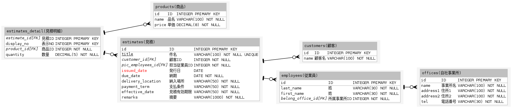

# erdot

'erdot lang' to 'dot lang' translator.

## install

```console
$ go get github.com/twinbird/erdot
```

or download [release binary](https://github.com/twinbird/erdot/releases).

## Usage

```console
$ erdot [erdot file]
```

or

```console
$ cat [erdot file] | erdot
```

In most cases, it is used in combination with 'graphviz' command as follows.

```console
$ erdot [erdot file] | dot -Tpng -o output.png
```

## erdot format

```
// This is a comment

# Tables

// Indent is '[tab]' or '2 or more [space]'
TableName[(alias name)]
	ColumnName[(alias name)] Type [Unique|PrimaryKey|NotNull|Default(value)]
	ColumnName[(alias name)] Type [Unique|PrimaryKey|NotNul|Default(value)l]
	ColumnName[(alias name)] Type [Unique|PrimaryKey|NotNul|Default(value)l]

# Relations

// one to one
ChildTableName.ColumnName 1-1 ParentTableName.ColumnName 

// 0 or 1 to one
ChildTableName.ColumnName ?-1 ParentTableName.ColumnName 

// 0 or more to one
ChildTableName.ColumnName *-1 ParentTableName.ColumnName 

// 1 or more to one
ChildTableName.ColumnName +-1 ParentTableName.ColumnName 
```

### Cardinality

| Cardinality   | Syntax   |
| ------------- | -------- |
| 0 or 1        | ?        |
| exactly 1     | 1        |
| 0 or more     | *        |
| 1 or more     | +        |

### Sample code

```console
// estimate print system

# Tables

// master

customers (顧客)
	id (ID) INTEGER PRIMARY KEY
	name (顧客名) VARCHAR(100) NOT NULL

offices (自社事業所)
	id (ID) INTEGER PRIMARY KEY
	name (事業所名) VARCHAR(100) NOT NULL
	address1 (住所1) VARCHAR(100) NOT NULL
	address2 (住所2) VARCHAR(100) NOT NULL
	tel (電話番号) VARCHAR(30) NOT NULL

products (商品)
	id (ID) INTEGER PRIMARY KEY
	name (品名) VARCHAR(100) NOT NULL
	price (単価) DECIMAL(8) NOT NULL

employees (従業員)
	id (ID) INTEGER PRIMARY KEY
	last_name (姓) VARCHAR(30) NOT NULL
	first_name (姓) VARCHAR(30) NOT NULL
	belong_office_id (所属事業所ID) INTEGER NOT NULL

// transaction

estimates (見積)
	id (ID) INTEGER PRIMARY KEY
	title (件名) VARCHAR(100) NOT NULL UNIQUE
	customer_id (顧客ID) INTEGER NOT NULL
	pic_employees_id (担当従業員ID) INTEGER NOT NULL
	issued_date (発行日) DATE 
	due_date (納期) DATE NOT NULL
	delivery_location (納入場所) VARCHAR(50) NOT NULL
	payment_term (支払条件) VARCHAR(50) NOT NULL
	effective_date (見積有効期限) VARCHAR(50) NOT NULL
	remarks (摘要) VARCHAR(1000) NOT NULL

estimates_detail (見積明細)
	estimate_id (見積ID) INTEGER PRIMARY KEY
	display_no (表示NO) INTEGER PRIMARY KEY
	product_id (商品ID) INTEGER NOT NULL
	quantity (数量) DECIMAL(5) NOT NULL

# Relations

employees.belong_office_id *-1 offices.id
estimates.pic_employees_id *-1 employees.id
estimates.customer_id *-1 customers.id
estimates_detail.estimate_id *-1 estimates.id
estimates_detail.product_id *-1 products.id
```

#### Sample output



### Lisence

MIT
